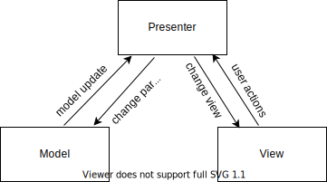

# Light range slider
JQuery плагин реализующий функционал бегунка.

## Архитектура проекта

Плагин реализует MVP архитектуру и содержит три основных слоя: Model, View and Presenter. 
### Model
Слой отвечает за хнанение состояний слайдера и изменение их при запросе Presenter - а.
### View
Слой отвечает за отображение слайдера и регистрацию действий пользователя.
### Presenter
Организет взаимодействие между Model и View, а так же обрабатывает API запросы.

Все взаимодействие между Model и View производится строго через Presenter.



Слои Model и View полностью ослеплены и не осведамлены, не только о существовании друг друга, но и о существовании слоя Presenter. В связи с чем, передача данных снизу в верх осуществляется при помощи ChangeObserver - а. При инициализации слайдера, Presenter подписывается на обновления слоев Model и View, передавая им соответствующие callback функции. При наступлении событий в Model и View они формируют объект события, и вызывают callback функцию, в которую и передают этот объект.
### UML - диаграмма


## Клонировать репозиторий
```git
$ git clone https://github.com/Rizarid/light-range-slider.git
```
## Установить зависимости
```
npm i
```
## Запустить тесты
```
npm run test:single
```
## Начало работы

Подключите JQuery и плагин:

```html
<script src="https://ajax.googleapis.com/ajax/libs/jquery/3.6.0/jquery.min.js"></script>
<link rel="stylesheet" type="text/css" href="light-range-slider.a41d4c721744ffe21a39.css">
<script src="light-range-slider.a8613c5aea034fa44649.js"></script>
```
Создайте контейнер для слайдера:

```html
<div class="slider"></div>
```

Инициализируйте плагин при помощи JQuery:

``` javascript
const slider = $('.slider');
slider.rangeSlider();
```

Для кастомизации слайдера, при инициализации передайте объект с необходимыми параметрами:
```javascript
const slider = $('.slider');
slider.rangeSlider({
  extremeValues: [250, 400],
  currentValues: [320]
});
// Создаст слайдер с  диапазоном значений от 250 до 400 и текущим значением слайдера 320
```
Что-бы получать новае значения параметров слайдера, при их изменении, передайте callback функцию в параметер callbacks:
```javascript
const callback = (event) => console.log(event.currentValues);
const slider = $('.slider');
slider.rangeSlider({callbacks: [callback] });
slider.setCurrentValues([60])
// Выведет в консоль: [60]
```
## Параметры

+ `extremeValues: number[]` - массив содержащий минимальное и максимальное знаачения диапазона слайдера. Значение по умолчанию `[0, 100]`.
+ `currentValues: number[]` - массив текущих значений слайдера. Количество значений которое необходимо передать зависит от параметра `isInterval`. Если `isInterval = true`, то необходимо передать два значения, в противном случае одно. Значение по умолчанию `[50]`.
+ `step: number` - шаг слайдера. Значение по умолчанию `1`.
+ `scaleStep: number` - шаг шкалы слайдера. Значение по умолчанию `10`.
+ `isVertical: boolean` - если значение параметра ровняется `true`, то слайдер переходит в вертикальный мод. Значение по умолчанию `false`.
+ `isInterval: boolean` - если значение параметра ровняется `true`, то слайдер переходит в интервальный мод. Значение по умолчанию `false`.
+ `isProgressBar: boolean` - определяет отображать или нет полосу прогресса. Значение по умолчанию `true`.
+ `isLabel: boolean` - определяет отображать или нет элемент над бегунком, содержащий значение слайдера. Значение по умолчанию `true`.
+ `isScale: boolean` - определяет отображать или нет шкалу слайдера. Значение по умолчанию `true`.
+ `callbacks: function[]` - массив функций которые вызываются при изменении модели. При вызове в функцию передается обект состояний слайдера.Значение поумолчанию `[]`
+ `isCollection: boolean` - если значение параметра ровняется `true`, то слайдер переходит в режим работы с коллекцией элементов, преданных через параметр `collection`.
+ `collection: number[] | string[] | HTMLElement[]` - массив значений между которыми переключается слайдер, в случе активации параметра `isCollection`.

## API

Для того, что-бы изменить параметры слайдера, не пересоздавая его, можно использовать следующие API методы:

+ `changeExtremeValues(number[]): JQuery` - изменяет параметр extremeValues. 
  ```javascript
    const slider = $('.slider');
    slider.rangeSlider({ extremeValues: [250, 400] });
    slider.changeExtremeValues([200, 300]);
    // Параметр extremeValues будет равен [200, 300]
  ```
+ `changeMinValue(number): JQuery` - изменяет минимальное значение слайдера.
  ```javascript
    const slider = $('.slider');
    slider.rangeSlider({ extremeValues: [250, 400] });
    slider.changeMinValue(300);
    // Параметр extremeValues будет равен [300, 400]
  ```
+ `changeMaxValue(number): JQuery` - изменяет максимальное значение слайдера.
  ```javascript
    const slider = $('.slider');
    slider.rangeSlider({ extremeValues: [250, 400] });
    slider.changeMinValue(350);
    // Параметр extremeValues будет равен [250, 350]
  ```
+ `changeCurrentValues(number[]): JQuery` - изменяет текущие значения слайдера.
  ```javascript
    const slider = $('.slider');
    slider.rangeSlider({ currentValues: [30, 70], isInterval: true });
    slider.changeCurrentValues([60, 80]);
    // Параметр currentValues будет равен [60, 80]
  ```
+ `changeMinCurrentValue(number): JQuery` - изменяет меньшее из текущих значений слайдера.
  ```javascript
    const slider = $('.slider');
    slider.rangeSlider({ currentValues: [30, 70], isInterval: true  });
    slider.changeMinCurrentValue(50);
    // Параметр currentValues будет равен [50, 70]
  ```
+ `changeMaxCurrentValue(number): JQuery` - изменяет большее из текущих значений слайдера. Если параметер `isInterval = false`, метод не сработает.
  ```javascript
    const slider = $('.slider');
    slider.rangeSlider({ currentValues: [30, 70], isInterval: true  });
    slider.changeMaxCurrentValue(50);
    // Параметр currentValues будет равен [30, 50]
  ```
+ `changeStep(number): JQuery` - изменяет параметр `step`.
  ```javascript
    const slider = $('.slider');
    slider.rangeSlider({ step: 5});
    slider.changeStep(10);
    // Параметр step будет равен 10
  ```
+ `changeScaleStep(number): JQuery` - изменяет параметр `scaleStep`.
  ```javascript
    const slider = $('.slider');
    slider.rangeSlider({ scaleStep: 10});
    slider.changeScaleStep(20);
    // Параметр scaleStep будет равен 20
  ```
+ `changeIsVertical(boolean): JQuery` - изменяет параметр `isVertical`.
  ```javascript
    const slider = $('.slider');
    slider.rangeSlider({ isVertical: false});
    slider.changeIsVertical(true);
    // Параметр isVertical будет равен true
  ```
+ `changeIsInterval(boolean): JQuery` - изменяет параметр `isInterval`.
  ```javascript
    const slider = $('.slider');
    slider.rangeSlider({ isInterval: false});
    slider.changeIsInterval(true);
    // Параметр isInterval будет равен true
  ```
+ `changeHaveProgressBar(boolean): JQuery` - изменяет параметр `haveProgressBar`.
  ```javascript
    const slider = $('.slider');
    slider.rangeSlider({ haveProgressBar: false});
    slider.changeHaveProgressBar(true);
    // Параметр haveProgressBar будет равен true
  ```
+ `changeHaveLabel(boolean): JQuery` - изменяет параметр `haveLabel`.
  ```javascript
    const slider = $('.slider');
    slider.rangeSlider({ haveLabel: false});
    slider.changeHaveLabel(true);
    // Параметр haveLabel будет равен true
  ```
+ `changeHaveScale(boolean): JQuery` - изменяет параметр `haveScale`.
  ```javascript
    const slider = $('.slider');
    slider.rangeSlider({ haveScale: false});
    slider.changeHaveScale(true);
    // Параметр haveScale будет равен true
  ```
+ `changeCallbacks(function[]): JQuery` - изменяет параметр `callbacks`.
  ```javascript
    const callback = (event) => console.log(event.currentValues);
    const slider = $('.slider');
    slider.rangeSlider();
    slider.changeCallbacks([callback]);
    // Параметр callbacks будет равен [callback]
  ```
+ `changeIsCollection(boolean): JQuery` - изменяет параметр `isCollection`.
  ```javascript
    const slider = $('.slider');
    slider.rangeSlider({ isCollection: false});
    slider.changeIsCollection(true);
    // Параметр isCollection будет равен true
  ```
+ `changeCollection(boolean): JQuery` - изменяет параметр collection.
  ```javascript
    const slider = $('.slider');
    slider.rangeSlider();
    slider.changeCollection(['one', 'two', 'three']);
    // Параметр collection будет равен ['one', 'two', 'three']
  ```

